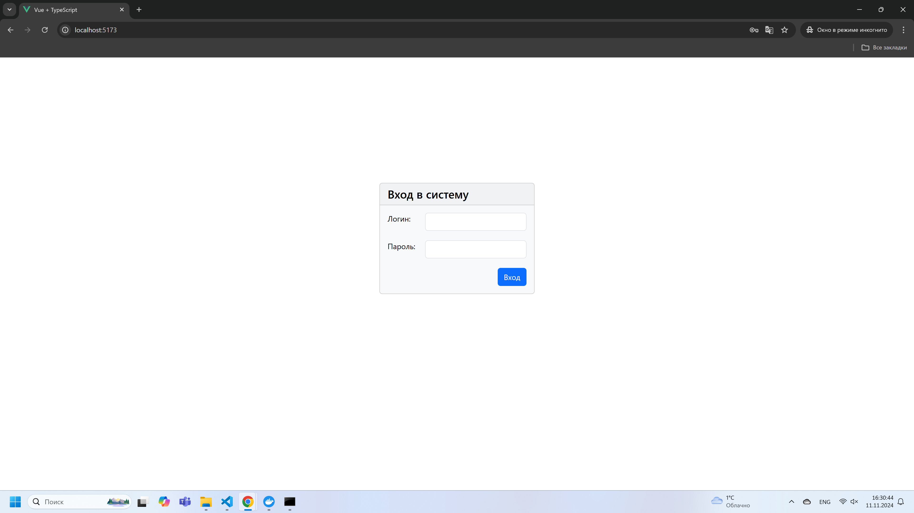
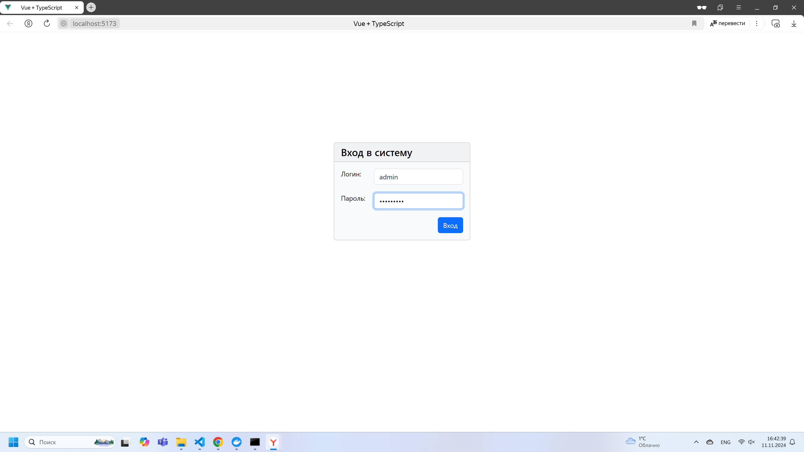
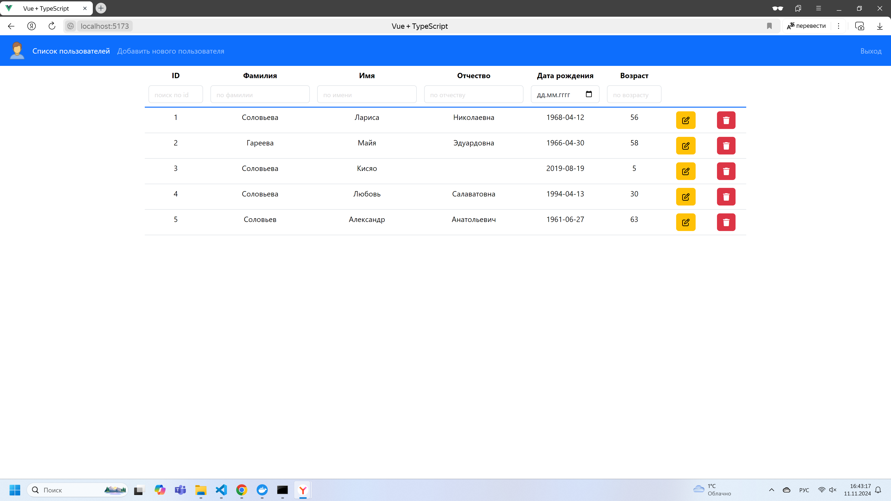
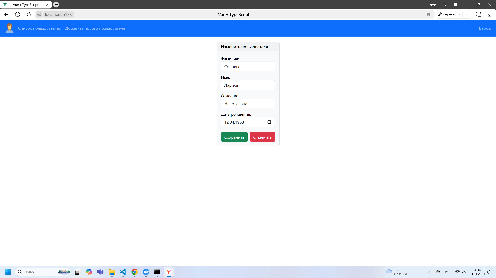
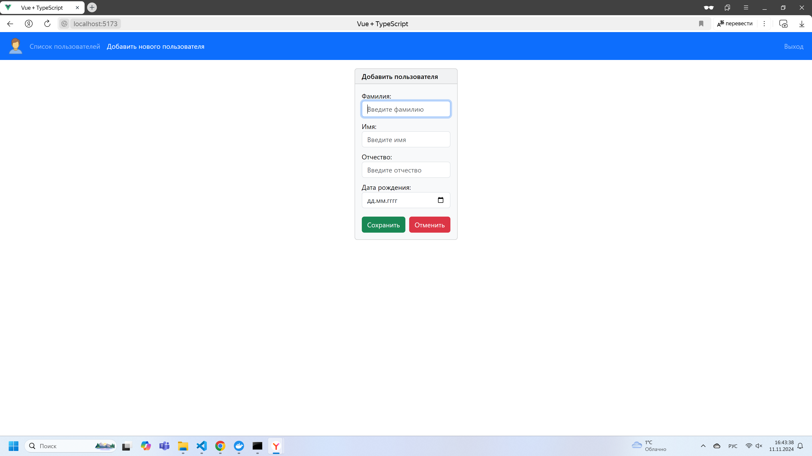
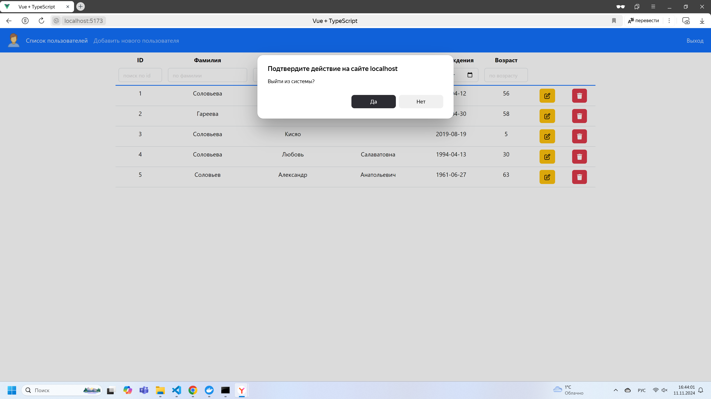
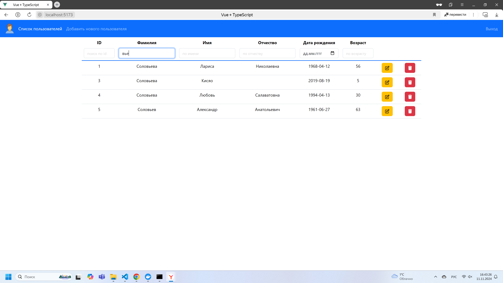

# 1. Описание проекта:

Данный проект является демонстрационным сервисом управления списком пользователей.  

В данном проекте можно: увидеть текущий список пользователей с ФИО, датой рождения и возрастом.  

Отредактировать или удалить существующего пользователя, а также создать нового пользователя.  

Версия node.js 20.9.0  

## 2. Запуск проекта:

2.1. Клонировать репозиторий   

2.2. В клонированной директории выполнить команду:     
     
```
npm install
```
     
2.3. В клонированной директории выполнить команду:  

```
npm run dev
```

## 3. Запустить серверную часть:

3.1. Скачать образ с сервером, команда для скачивания:  

```
docker pull gareevaliubov/vue-users-api:1.0
```

3.2. Запустить образ с сервером, команда для запуска:   

```
docker run -it --rm -p 8080:8080 --name vue-users-api-container gareevaliubov/vue-users-api:1.0
```

## 4. Учетные данные для входа:

логин: `admin`  

пароль: `aaaAAA!!!`


## 5. Доступный функционал: 

В проекте 4 компонента, каждый со своим функционалом.  
 
5.1. Компонент `Authorization.vue` проверяет право доступа пользователя в систему с помощью учетных данных логин/пароль. В случае неверно введенных данных - пользователь получает отказ на вход в систему.  
     
5.2. Компонент `EditUser.vue` отвечает за создание нового пользователя и изменение существующего пользователя в зависимости от действий пользователя (изменение пользователя подвязан на кнопку "изменение пользователя" в компоненте `Users.vue`, а создание нового пользователя на кнопку: "Добавить нового пользователя" в компоненте `Menu.vue`).  
     
5.3. Компонент `Menu.vue` является navbar, с помощью которого можно перейти на страницу всех пользователей (стартовая страница после авторизации), перейти на страницу создания нового пользователя, а также выйти из учетной записи.  
     
5.4. Компонент `Users.vue` содержит в себе таблицу пользователей. В данной таблице пользователей можно отсортировать по каждому полю (фамилия, имя, отчество, дата рождения, возраст) прямой и обратной сортировкой. Есть по каждому полю поисковая строка, где при частичном или полном введении данных отобразятся пользователи с совпадением. Также есть кнопки для удаления или редактирования каждого пользователя.    


## 6. Скриншоты приложения  








